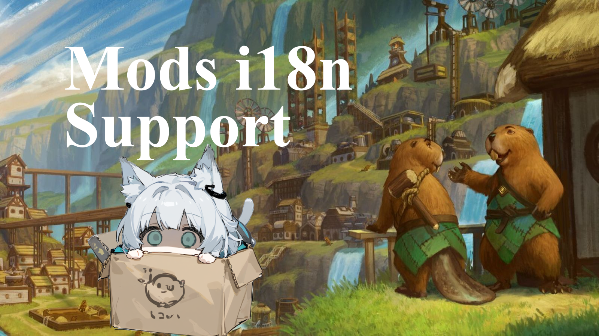

# Timberborn Mods Universial Translate



Get mod?

 - [Download From Github Release](https://github.com/wuyilingwei/Timberborn_Mods_Universal_Translate/releases/latest)

 - [Subscribe On Steam Workshop](https://steamcommunity.com/sharedfiles/filedetails/?id=3346918947)

## Join us

```
Video Games, our passion.
Creativity. Innovation.
Our part of life.
But what if the text doesn't speak your language?
No...I can't understand...

*UNKNOWN LANGUAGES*

Look Familiar?
Scenes like these are happening all over the internet, right now!
You could be next.
<- a exciting music ->
That is unless you make the most important decision of your life.
Prove to yourself that you have the dedication and skill to bridge language barriers.
Join...the Translators.
Become part of an elite force dedicated to expanding the modding universe.
See the world through new words.
And spread Each Idea across the globe.
Become a hero.
Become a legend.

BECOME A TRANSLATOR.
```

First you need a GitHub account, then fill in [JOIN US](https://github.com/wuyilingwei/Timberborn_Mods_Universal_Translate/issues), and then I will give you editing permissions for the repository.

You can use any git software (such as [Github desktop](https://github.com/apps/desktop)) + text editor (such as [VSC](https://code.visualstudio.com/download)) to edit and upload your changes. We do not require signatures for commits.

An automatic script will create the latest language files based on `/data` and `mod updates keys`, and syncs changes to Steam every day.

For the source code of the relevant program, please visit https://github.com/wuyilingwei/Timberborn_Tools

## Our rules

It uses both of AI and manual work, with AI responsible for providing translation support as quickly as possible and reducing workload, and manual work for proofreading and modification.

We are not responsible for the accuracy of the translated text.

The content that is not accepted for translation is:

 - Built in ID: These keys be used internally in the game. Modifying it may cause unpredictable modifications to the raw game and violate our "universal" principle. Players who do not install the corresponding mod may be modified.
 - Any content that violates public order and morals will not be translated to avoid potential problems. This includes but is not limited to: racial discrimination, adult content, etc.

## Q&A

### Why use github? Instead of giving direct access to steam workshop?

Unfortunately, Steam is obviously not designed for multiplayer collaboration, it only gives upload permissions.

This brings a series of problems, including: it is impossible to ensure that you change on the latest version, it is impossible to quantify contributions, it is impossible to record historical changes for comparison, and it is inconvenient for others to join, it is also never a good idea to use the comments to track an issue.

If you want to develop a third-party tool, you will always be required to save the steam login credentials to pull and upload, which is not good and has security risks. On the contrary, through github you can make changes to the mod without logging into steam, and it has full git feature support.
